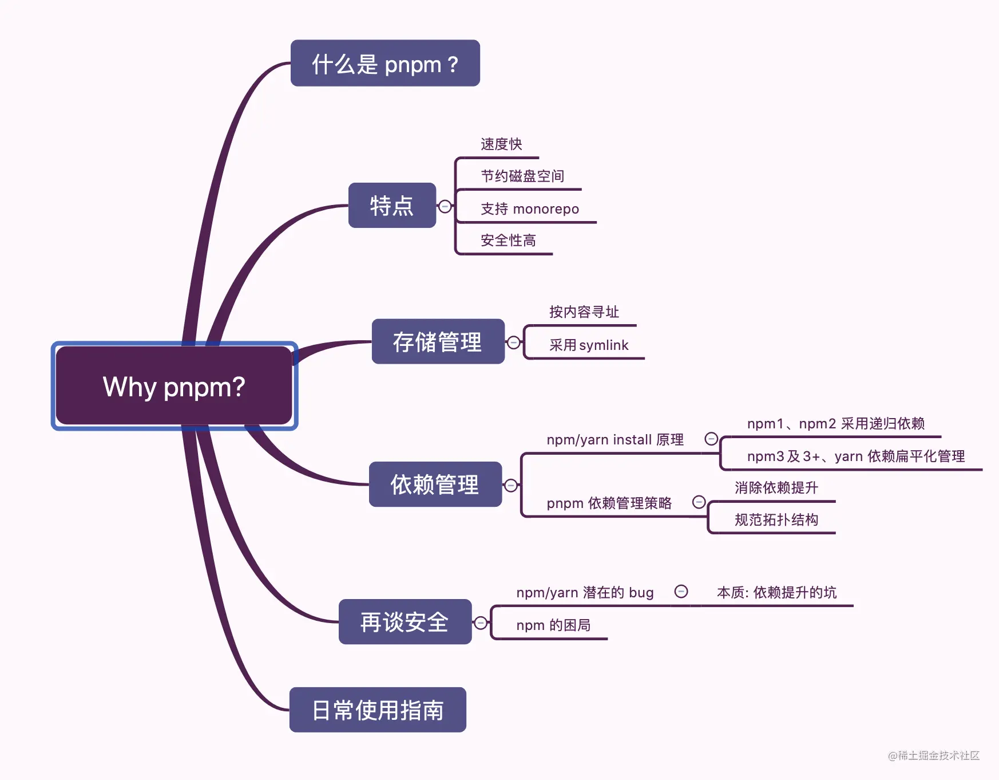

## 1、monorepo
Monorepo是一种项目管理方式，就是把多个项目放在一个仓库里面。
一般 Monorepo 的目录如下所示，在 packages 存放多个子项目，并且每个子项目都有自己的**package.json**
```js
├── packages
|   ├── pkg1
|   |   ├── package.json
|   ├── pkg2
|   |   ├── package.json
├── package.json

```
### MultiRepo的痛点
要想知道 Monorepo 的优势，首先得弄清楚之前的开发方式有什么痛点。

传统的方式MultiRepo当中，每个项目都对应单独的一个代码仓库，是真真切切地感受到了这种方式带来的诸多弊端。
- 1.代码复用
   维护多个项目时，一些基础的组件、工具函数，或者一些配置，出现bug、或者需要调整的时候，就得修改多份，维护成本越来越高
- 2.版本管理
  当某一个工具包版本是 v1.0.0，有诸多项目都依赖于这个工具包，但在某个时刻，这个工具包发了一个 **change** 版本，和原来版本的 API 完全不兼容。而事实上有些项目并没有升级这个依赖，导致一些莫名的报错
- 3.项目基建
    由于在 MultiRepo 当中，各个项目的工作流是割裂的，因此每个项目需要单独配置开发环境、配置 CI 流程、配置部署发布流程等等，甚至每个项目都有自己单独的一套脚手架工具。
    其实，很容易发现这些项目里的很多基建的逻辑都是重复的，如果是 10 个项目，就需要维护 10 份基建的流程，逻辑重复不说，各个项目间存在构建、部署和发布的规范不能统一的情况，这样维护起来就更加麻烦了

### 优点
- 依赖管理：共享依赖，所有的代码都在一个仓库。版本管理非常方便；

- 基建成本降低：所有项目复用一套标准的工具、组件和规范，代码质量和统一风格更容易；有新的项目接入，也可以直接复用已有的基建流程，比如 CI 流程、构建和发布流程

- 团队协作更容易：所有人都能看到全部代码，能够方便地共享和复用代码，跨团队协作和贡献更容易；


## 2、pnpm

pnpm 本质上就是一个包管理器，这一点跟 npm/yarn 没有区别。杀手锏在于：
- 包安装速度极快；
- 磁盘空间利用非常高效

### 特点
- 1. 速度快
- 2. 高效利用磁盘空间
  - 不会重复安装同一个包。用 npm/yarn 的时候，如果 100 个项目都依赖 lodash，那么 lodash 很可能就被安装了 100 次，磁盘中就有 100 个地方写入了这部分代码。但在使用 pnpm 只会安装一次，磁盘中只有一个地方写入，后面再次使用都会直接使用 **hardlink 硬链接**
  - 即使一个包的不同版本，pnpm 也会极大程度地复用之前版本的代码。举个例子，比如 lodash 有 100 个文件，更新版本之后多了一个文件，那么磁盘当中并不会重新写入 101 个文件，而是保留原来的 100 个文件的 **hardlink**，仅仅写入那一个**新增的文件**
- 3. 支持 monorepo
- 4. 安全性高
  - 之前在使用 npm/yarn 的时候，由于 node_module 的扁平结构，如果 A 依赖 B， B 依赖 C，那么 A 当中是可以直接使用 C 的，但问题是 A 当中并没有声明 C 这个依赖。因此会出现这种非法访问的情况。但 pnpm 脑洞特别大，自创了一套依赖管理方式，很好地解决了这个问题，保证了安全性

## 创建项目

- 1.安装
```js
 npm i pnpm -g
```

- 2.初始化package
```js
 pnpm init
```
- 3.创建 .npmrc 文件
  根据需要添加配置

- 4.创建pnpm-workspace.yaml文件，工作空间的根目录
```js
  packages:
  - 'packages/**'
```
- 5.添加项目配置等
```js
eslintignore、gitignore、eslint、stylelint、prettier、husky、lint-staged、commitlint
```


### 3、目录结构
├── packages/
|   ├── kmlet-shared/      // 公共方法
|   ├── kmlet-ui/          // 核心UI库
|   ├── kmlet-uni/         // UI库测试项目

### 4、测试项目

### 5、组件文档

  